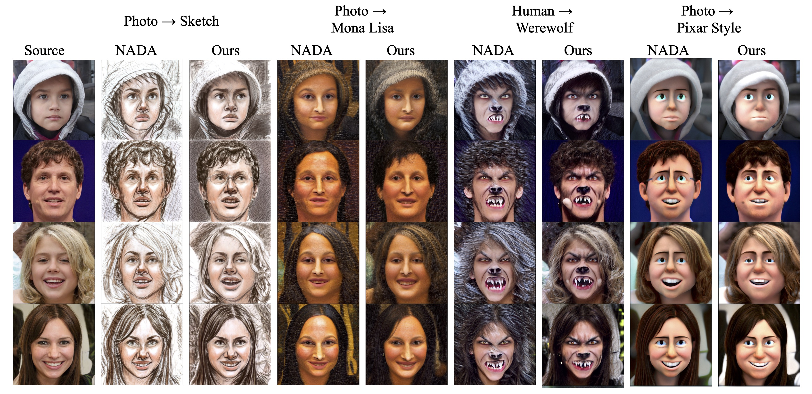

# (ICCV 2023) Text-Driven Generative Domain Adaptation with Spectral Consistency Regularization
<div align="center">
  
[](https://openaccess.thecvf.com/content/ICCV2023/papers/Liu_Text-Driven_Generative_Domain_Adaptation_with_Spectral_Consistency_Regularization_ICCV_2023_paper.pdf)

</div>


## Setup

### Requirements
The project is managed with `uv`[https://github.com/astral-sh/uv], install uv first by:
```bash
curl -LsSf https://astral.sh/uv/install.sh | sh
```

### Download StyleGAN2 checkpoint
- Download pretrained StyleGAN2 generator from [here](https://drive.google.com/file/d/1EM87UquaoQmk17Q8d5kYIAHqu0dkYqdT/view?usp=sharing).


## Training
### Usage

To convert a generator from one domain to another, run the training script in the ZSSGAN directory:

```
uv run train.py size=1024  \
                task=photo2sketch \
                lambda_spectral=1 \
                batch=2  \
                n_sample=4 \
                lr=0.002 \
                frozen_gen_ckpt="/path/to/stylegan2-ffhq-config-f.pt" \
                train_gen_ckpt="/path/to/stylegan2-ffhq-config-f.pt" \
                iter=301 \
                source_class="photo" \
                target_class="sketch" \
                output_interval=50 \
                clip_models="[ViT-B/32,ViT-B/16]" \
                clip_model_weights="[1.0,1.0]" \
                save_interval=150
```


## Experimental Results

### Text-guided Image Generation



### One-shot Domain Adaptation

